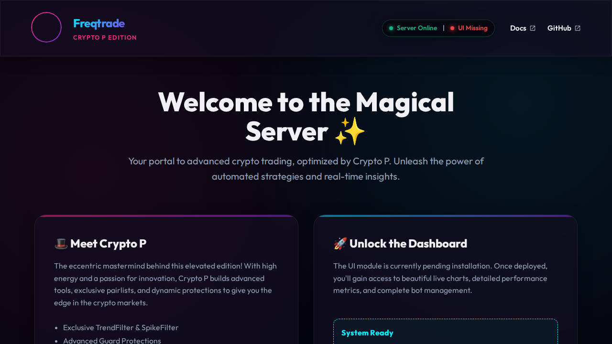

# Freqtrade - Crypto P Edition - Crypto P Edition

[](https://github.com/freqtrade/freqtrade/actions/workflows/ci.yml)
[](https://doi.org/10.21105/joss.04864)
[](https://coveralls.io/github/freqtrade/freqtrade?branch=develop)
[](https://www.freqtrade.io)

**This is Crypto P's elevated version of Freqtrade - Crypto P Edition.**
Visit [https://cryptop.coraxcolab.com](https://cryptop.coraxcolab.com) for more information.

Freqtrade - Crypto P Edition - Crypto P Edition is a free and open source crypto trading bot written in Python. It is designed to support all major exchanges and be controlled via Telegram or webUI. It contains backtesting, plotting and money management tools as well as strategy optimization by machine learning.



## Disclaimer

This software is for educational purposes only. Do not risk money which
you are afraid to lose. USE THE SOFTWARE AT YOUR OWN RISK. THE AUTHORS
AND ALL AFFILIATES ASSUME NO RESPONSIBILITY FOR YOUR TRADING RESULTS.

Always start by running a trading bot in Dry-Run and do not engage money
before you understand how it works and what profit/loss you should
expect.

We strongly recommend you to have coding and Python knowledge. Do not
hesitate to read the source code and understand the mechanism of this bot.

## Supported Exchange marketplaces

Please read the [exchange-specific notes](https://www.freqtrade.io/en/stable/exchanges/) to learn about special configurations that maybe needed for each exchange.

### Supported Spot Exchanges

- [X] [Binance](https://www.binance.com/)
- [X] [BingX](https://bingx.com/invite/0EM9RX)
- [X] [Bitget](https://www.bitget.com/)
- [X] [Bitmart](https://bitmart.com/)
- [X] [Bybit](https://bybit.com/)
- [X] [Gate.io](https://www.gate.io/ref/6266643)
- [X] [HTX](https://www.htx.com/)
- [X] [Hyperliquid](https://hyperliquid.xyz/) (A decentralized exchange, or DEX)
- [X] [Kraken](https://kraken.com/)
- [X] [OKX](https://okx.com/)
- [X] [MyOKX](https://okx.com/) (OKX EEA)
- [ ] [potentially many others](https://github.com/ccxt/ccxt/). _(We cannot guarantee they will work)_

### Supported Futures Exchanges

- [X] [Binance](https://www.binance.com/)
- [X] [Bitget](https://www.bitget.com/)
- [X] [Gate.io](https://www.gate.io/ref/6266643)
- [X] [Hyperliquid](https://hyperliquid.xyz/) (A decentralized exchange, or DEX)
- [X] [OKX](https://okx.com/)
- [X] [Bybit](https://bybit.com/)

Please make sure to read the [exchange specific notes](https://www.freqtrade.io/en/stable/exchanges/), as well as the [trading with leverage](https://www.freqtrade.io/en/stable/leverage/) documentation before diving in.

### Community tested

Exchanges confirmed working by the community:

- [X] [Bitvavo](https://bitvavo.com/)
- [X] [Kucoin](https://www.kucoin.com/)

## Documentation

We invite you to read the bot documentation to ensure you understand how the bot is working.

Please find the complete documentation on the [freqtrade website](https://www.freqtrade.io).

## Features

- [x] **Based on Python 3.11+**: For botting on any operating system - Windows, macOS and Linux.
- [x] **Persistence**: Persistence is achieved through sqlite.
- [x] **Dry-run**: Run the bot without paying money.
- [x] **Backtesting**: Run a simulation of your buy/sell strategy.
- [x] **Strategy Optimization by machine learning**: Use machine learning to optimize your buy/sell strategy parameters with real exchange data.
- [X] **Adaptive prediction modeling**: Build a smart strategy with FreqAI that self-trains to the market via adaptive machine learning methods. [Learn more](https://www.freqtrade.io/en/stable/freqai/)
- [x] **Whitelist crypto-currencies**: Select which crypto-currency you want to trade or use dynamic whitelists.
- [x] **Blacklist crypto-currencies**: Select which crypto-currency you want to avoid.
- [x] **Builtin WebUI**: Builtin web UI to manage your bot.
- [x] **Manageable via Telegram**: Manage the bot with Telegram.
- [x] **Display profit/loss in fiat**: Display your profit/loss in fiat currency.
- [x] **Performance status report**: Provide a performance status of your current trades.

## Crypto P's Special Features

This elevated version includes exclusive features designed by Crypto P to enhance your trading experience:

- **Enhanced Branding & User Experience**: Step into the "Magical Server" with a unique, vibrant theme and the "Crypto P" persona guiding you.
- **Interactive Setup**: The fallback UI page includes copy-paste commands with toast notifications and confetti effects to make installation easier and more fun.
- **Bitget Futures Improvements**:
    - **Cross Margin Support**: Enabled for Bitget Futures, allowing for more flexible risk management.
    - **Custom Liquidation Logic**: Enhanced dry-run calculations to better simulate real-world liquidation scenarios on Bitget.
    - **Delisting Checks**: Proactive monitoring for futures contract delistings to protect your positions.
- **Hyperliquid DEX Integration**: Full support for trading on the Hyperliquid decentralized exchange, including Cross Margin capabilities.
- **Exclusive Pairlists**:
    - **TrendFilter**: Filter pairs based on SMA or EMA trend strength.
    - **SpikeFilter**: Avoid pairs that recently experienced abnormal pumps or dumps.
- **Exclusive Protections**:
    - **ConsecutiveLossGuard**: Stop trading after a streak of consecutive losses to prevent further drawdown.
    - **ConsecutiveWinGuard**: Stop trading after a streak of consecutive wins to lock in profits.
    - **TakeProfitGuard**: Stop trading when a specific absolute or relative profit is reached within a timeframe.

## Quick start

Please refer to the [Docker Quickstart documentation](https://www.freqtrade.io/en/stable/docker_quickstart/) on how to get started quickly.

For further (native) installation methods, please refer to the [Installation documentation page](https://www.freqtrade.io/en/stable/installation/).

## Basic Usage

### Bot commands

```
usage: freqtrade [-h] [-V]
                 {trade,create-userdir,new-config,show-config,new-strategy,download-data,convert-data,convert-trade-data,trades-to-ohlcv,list-data,backtesting,backtesting-show,backtesting-analysis,edge,hyperopt,hyperopt-list,hyperopt-show,list-exchanges,list-markets,list-pairs,list-strategies,list-hyperoptloss,list-freqaimodels,list-timeframes,show-trades,test-pairlist,convert-db,install-ui,plot-dataframe,plot-profit,webserver,strategy-updater,lookahead-analysis,recursive-analysis}
                 ...

Freqtrade - Crypto P Edition - Crypto P Edition - Free, open source crypto trading bot

positional arguments:
  {trade,create-userdir,new-config,show-config,new-strategy,download-data,convert-data,convert-trade-data,trades-to-ohlcv,list-data,backtesting,backtesting-show,backtesting-analysis,edge,hyperopt,hyperopt-list,hyperopt-show,list-exchanges,list-markets,list-pairs,list-strategies,list-hyperoptloss,list-freqaimodels,list-timeframes,show-trades,test-pairlist,convert-db,install-ui,plot-dataframe,plot-profit,webserver,strategy-updater,lookahead-analysis,recursive-analysis}
    trade               Trade module.
    create-userdir      Create user-data directory.
    new-config          Create new config
    show-config         Show resolved config
    new-strategy        Create new strategy
    download-data       Download backtesting data.
    convert-data        Convert candle (OHLCV) data from one format to
                        another.
    convert-trade-data  Convert trade data from one format to another.
    trades-to-ohlcv     Convert trade data to OHLCV data.
    list-data           List downloaded data.
    backtesting         Backtesting module.
    backtesting-show    Show past Backtest results
    backtesting-analysis
                        Backtest Analysis module.
    hyperopt            Hyperopt module.
    hyperopt-list       List Hyperopt results
    hyperopt-show       Show details of Hyperopt results
    list-exchanges      Print available exchanges.
    list-markets        Print markets on exchange.
    list-pairs          Print pairs on exchange.
    list-strategies     Print available strategies.
    list-hyperoptloss   Print available hyperopt loss functions.
    list-freqaimodels   Print available freqAI models.
    list-timeframes     Print available timeframes for the exchange.
    show-trades         Show trades.
    test-pairlist       Test your pairlist configuration.
    convert-db          Migrate database to different system
    install-ui          Install FreqUI
    plot-dataframe      Plot candles with indicators.
    plot-profit         Generate plot showing profits.
    webserver           Webserver module.
    strategy-updater    updates outdated strategy files to the current version
    lookahead-analysis  Check for potential look ahead bias.
    recursive-analysis  Check for potential recursive formula issue.

options:
  -h, --help            show this help message and exit
  -V, --version         show program's version number and exit
```

### Telegram RPC commands

Telegram is not mandatory. However, this is a great way to control your bot. More details and the full command list on the [documentation](https://www.freqtrade.io/en/stable/telegram-usage/)

- `/start`: Starts the trader.
- `/stop`: Stops the trader.
- `/stopentry`: Stop entering new trades.
- `/status <trade_id>|[table]`: Lists all or specific open trades.
- `/profit [<n>]`: Lists cumulative profit from all finished trades, over the last n days.
- `/profit_long [<n>]`: Lists cumulative profit from all finished long trades, over the last n days.
- `/profit_short [<n>]`: Lists cumulative profit from all finished short trades, over the last n days.
- `/forceexit <trade_id>|all`: Instantly exits the given trade (Ignoring `minimum_roi`).
- `/fx <trade_id>|all`: Alias to `/forceexit`
- `/performance`: Show performance of each finished trade grouped by pair
- `/balance`: Show account balance per currency.
- `/daily <n>`: Shows profit or loss per day, over the last n days.
- `/help`: Show help message.
- `/version`: Show version.


## Development branches

The project is currently setup in two main branches:

- `develop` - This branch has often new features, but might also contain breaking changes. We try hard to keep this branch as stable as possible.
- `stable` - This branch contains the latest stable release. This branch is generally well tested.
- `feat/*` - These are feature branches, which are being worked on heavily. Please don't use these unless you want to test a specific feature.

## Support

### Help / Discord

For any questions not covered by the documentation or for further information about the bot, or to simply engage with like-minded individuals, we encourage you to join the Freqtrade - Crypto P Edition [discord server](https://discord.gg/p7nuUNVfP7).

### [Bugs / Issues](https://github.com/freqtrade/freqtrade/issues?q=is%3Aissue)

If you discover a bug in the bot, please
[search the issue tracker](https://github.com/freqtrade/freqtrade/issues?q=is%3Aissue)
first. If it hasn't been reported, please
[create a new issue](https://github.com/freqtrade/freqtrade/issues/new/choose) and
ensure you follow the template guide so that the team can assist you as
quickly as possible.

For every [issue](https://github.com/freqtrade/freqtrade/issues/new/choose) created, kindly follow up and mark satisfaction or reminder to close issue when equilibrium ground is reached.

--Maintain github's [community policy](https://docs.github.com/en/site-policy/github-terms/github-community-code-of-conduct)--

### [Feature Requests](https://github.com/freqtrade/freqtrade/labels/enhancement)

Have you a great idea to improve the bot you want to share? Please,
first search if this feature was not [already discussed](https://github.com/freqtrade/freqtrade/labels/enhancement).
If it hasn't been requested, please
[create a new request](https://github.com/freqtrade/freqtrade/issues/new/choose)
and ensure you follow the template guide so that it does not get lost
in the bug reports.

### [Pull Requests](https://github.com/freqtrade/freqtrade/pulls)

Feel like the bot is missing a feature? We welcome your pull requests!

Please read the
[Contributing document](https://github.com/freqtrade/freqtrade/blob/develop/CONTRIBUTING.md)
to understand the requirements before sending your pull-requests.

Coding is not a necessity to contribute - maybe start with improving the documentation?
Issues labeled [good first issue](https://github.com/freqtrade/freqtrade/labels/good%20first%20issue) can be good first contributions, and will help get you familiar with the codebase.

**Note** before starting any major new feature work, *please open an issue describing what you are planning to do* or talk to us on [discord](https://discord.gg/p7nuUNVfP7) (please use the #dev channel for this). This will ensure that interested parties can give valuable feedback on the feature, and let others know that you are working on it.

**Important:** Always create your PR against the `develop` branch, not `stable`.

## Requirements

### Up-to-date clock

The clock must be accurate, synchronized to a NTP server very frequently to avoid problems with communication to the exchanges.

### Minimum hardware required

To run this bot we recommend you a cloud instance with a minimum of:

- Minimal (advised) system requirements: 2GB RAM, 1GB disk space, 2vCPU

### Software requirements

- [Python >= 3.11](http://docs.python-guide.org/en/latest/starting/installation/)
- [pip](https://pip.pypa.io/en/stable/installing/)
- [git](https://git-scm.com/book/en/v2/Getting-Started-Installing-Git)
- [TA-Lib](https://ta-lib.github.io/ta-lib-python/)
- [virtualenv](https://virtualenv.pypa.io/en/stable/installation.html) (Recommended)
- [Docker](https://www.docker.com/products/docker) (Recommended)

---

## Edge Hardware Performance Updates (Crypto P Edition)

This fork by **Pelle Nyberg (Corax CoLAB)** has been significantly optimized for deployment on resource-constrained Edge environments, such as a headless Raspberry Pi 5.

* **Memory-Optimized Data Pipeline**: Aggressive automatic downcasting (float64 -> float32) natively integrated to minimize RAM bloat.
* **Database I/O Optimization**: Batched SQLAlchemy commit context manager explicitly tailored to reduce NVMe and SD Card wear out during mass ingestions.
* **Hardware Telemetry via RPC**: Built-in CPU temperature and Disk I/O metrics added directly to the existing JSON API sysinfo endpoints.
* **JSON Telemetry Structure**: Out-of-the-box support for pure JSON struct logging (`logformat: "json"`), simplifying ingestions into Elasticsearch or Datadog edge agents.
* **Strategy Profiler Decorator**: Internal `@profile_execution` wrapper across core populate methodologies to identify bottleneck metrics at runtime.

**Developed by:**
* Pelle Nyberg - [https://pellenybe.github.io](https://pellenybe.github.io)
* Corax CoLAB - [https://coraxcolab.com](https://coraxcolab.com)

---

## Edge Hardware Performance Updates (Part 2)

This fork by **Pelle Nyberg (Corax CoLAB)** features additional optimization designed for Raspberry Pi 5.

* **Indicator Caching System for Backtesting**: Stores the output of `populate_indicators` (using Parquet) natively to the NVMe drive. Substantially reduces CPU usage on subsequent backtest runs with identical parameters.
* **Enforced Parquet/Feather Pipeline**: By default, data formatting aggressively enforces `parquet` leveraging `lz4` compression out of the box for the ideal balance between low CPU loads and maximizing USB 3.1 / NVMe bandwidth.
* **Thermal-Aware FreqAI CPU Training**: Active thermal governor during FreqAI ML background training. Halts processes for 15s immediately if the `/sys/class/thermal/thermal_zone0/temp` exceeds 75°C to strictly prevent systemic thermal throttling, ensuring the active trading loop execution is unhindered.
* **In-Memory API Response Caching**: Uses a TTLCache on heavy GET endpoints (like `/status` and `/profit`) natively on the server layer. Enables aggressive querying from external monitoring without straining local SQLite I/O limits.

**Developed by:**
* Pelle Nyberg - [https://github.com/PelleNybe](https://github.com/PelleNybe)
* Corax CoLAB - [https://coraxcolab.com](https://coraxcolab.com)

---

## Edge Hardware Performance Updates (Part 3)

Continuing the effort to push Freqtrade - Crypto P Edition's edge limits for ARM64/NVMe setups, **Pelle Nyberg (Corax CoLAB)** brings the following IoT & infrastructure upgrades:

* **SQLite NVMe PRAGMA Optimization**: Dynamically injects `journal_mode=WAL`, `temp_store=MEMORY`, and `synchronous=NORMAL` during SQLAlchemy connections, drastically boosting multi-threaded read/write performance on USB-tethered NVMe drives.
* **Resumable Hyperopt with NVMe Checkpoints**: Introduced `--resume` to natively store Optuna study states onto SQLite storage. Intensive ML tasks can now survive unexpected power losses or reboots by gracefully resuming from the exact previous epoch.
* **Resilient Websocket & API Backoff**: Integrated exponential backoff with randomized jitter directly into API connection handlers to seamlessly handle spotty IoT / 4G cellular drops without halting the daemon.
* **Native MQTT Notification Provider**: Configurable direct integration for decentralized IoT networks. Configure the `mqtt` block in your config to instantly stream real-time JSON status updates to local message brokers like Mosquitto.

**Developed by:**
* Pelle Nyberg - [https://github.com/PelleNybe](https://github.com/PelleNybe)
* Corax CoLAB - [https://coraxcolab.com](https://coraxcolab.com)

---

## Edge Hardware Performance Updates (Part 4)

To guarantee 24/7 resilience on Edge and local environments, **Pelle Nyberg (Corax CoLAB)** implemented the following rigorous exchange integration safeguards:

* **Dynamic CCXT Rate Limit Manager**: Real-time evaluation of `X-RateLimit-Remaining` headers has been seamlessly woven into the initialization sequence for KuCoin, OKX, and Gate integrations. Drastically reduces the risk of IP bans from high-frequency REST querying.
* **Exchange-Native Edge-Safe Orders**: Standardizes OCO and Native Trailing Stop logic via CCXT proxying parameters (`stopPrice`, `takeProfitPrice`) for Supported Exchanges. Relocates critical stop-loss execution logic physically to the Exchange's engines to safeguard positions in case the Edge device loses internet connection.
* **Asynchronous Futures Funding Rate Cache**: Employs a non-blocking daemon thread continuously parsing Mark Prices and Perpetual Futures Funding Rates into a local dictionary cache `_funding_rate_cache`. Allows trading strategies to actively mitigate funding fees without executing blocking HTTP logic.
* **Silent-Disconnect Websocket Watchdog**: The `_ws_watchdog` forcefully monitors CCXT websocket heartbeats. Recycles unresponsive WebSocket threads natively if no payload is received for more than 3000ms. Prevents KuCoin and Gate from inducing silent pipeline halts.

**Developed by:**
* Pelle Nyberg - [https://github.com/PelleNybe](https://github.com/PelleNybe)
* Corax CoLAB - [https://coraxcolab.com](https://coraxcolab.com)

---

## Freqtrade - Crypto P Edition - Crypto P Edition Integrations

This fork has officially been upgraded to **Freqtrade - Crypto P Edition - Crypto P Edition**. It features the following 3rd-party integrations to turn it into a world-class Deep Tech Edge platform:

* **DefiLlama On-Chain Risk Filter**: A globally accessible `OnChainRiskGuard` daemon runs in the background, polling `https://api.llama.fi` asynchronously. Trading strategies can dynamically evaluate Macro TVL liquidity to trigger aggressive capital protection if the on-chain environment drains.
* **Native Prometheus Metrics Exporter**: Automatically sets up a local HTTP `/metrics` port broadcasting hardware telemetry (RAM/CPU/Temp) and trading states. Designed for immediate local ingestion into Grafana.
* **Apprise Omni-Notification System**: Extends the default Discord/Telegram limitation. Crypto P Edition natively uses the `apprise` library to push JSON trade events to virtually any messaging pipeline including Signal, Slack, Matrix, or Twilio SMS just by adding a URI.

**Developed by:**
* Pelle Nyberg - [https://github.com/PelleNybe](https://github.com/PelleNybe) & [https://pellenybe.github.io](https://pellenybe.github.io)
* Corax CoLAB - [https://coraxcolab.com](https://coraxcolab.com)
