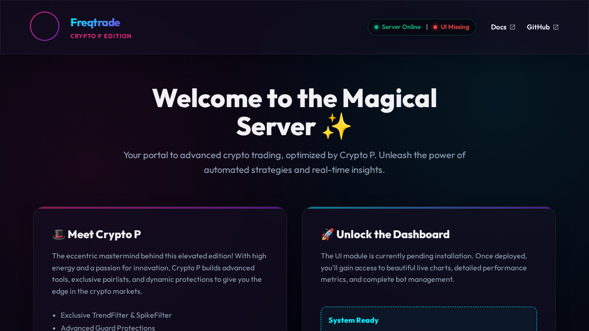

# 🚀 Freqtrade - Crypto P Edition 🚀

 

**The ultimate open-source crypto trading bot.**
*Elevated for Deep Tech, Edge Hardware, and Peak Performance.*

---

## 🌟 Developed by Pelle Nyberg & Corax CoLAB

  
  

 

**Pelle Nyberg** is a visionary software engineer specializing in algorithmic trading, edge computing, and Deep Tech integrations. In collaboration with **Corax CoLAB**, this fork of Freqtrade has been ruthlessly optimized to dominate on resource-constrained hardware while adding bleeding-edge macro-level protections.

🔗 **Connect with Pelle:**
* **GitHub:** [PelleNybe](https://github.com/PelleNybe)
* **LinkedIn:** [Pelle Nyberg](https://www.linkedin.com/in/pellenyberg/)
* **Portfolio:** [pellenybe.github.io](https://pellenybe.github.io)

🏢 **Corax CoLAB:**
* **Website:** [coraxcolab.com](https://coraxcolab.com)
* **Project Hub:** [cryptop.coraxcolab.com](https://cryptop.coraxcolab.com)

---

## 🔥 Why Crypto P Edition?

This is **Crypto P's elevated version** of Freqtrade. It retains all the incredible core features of Freqtrade—backtesting, plotting, money management, machine learning (FreqAI)—but supercharges them for modern IoT, Edge, and resilient 24/7 autonomous deployment.

<b>🛠️ Edge Hardware Performance Updates (Part 1 & 2)</b>

* **Memory-Optimized Data Pipeline**: Aggressive automatic downcasting (float64 -> float32) natively integrated to minimize RAM bloat.
* **Database I/O Optimization**: Batched SQLAlchemy commit context manager explicitly tailored to reduce NVMe and SD Card wear out during mass ingestions.
* **Hardware Telemetry via RPC**: Built-in CPU temperature and Disk I/O metrics added directly to the existing JSON API sysinfo endpoints.
* **JSON Telemetry Structure**: Out-of-the-box support for pure JSON struct logging (`logformat: "json"`), simplifying ingestions into Elasticsearch or Datadog edge agents.
* **Strategy Profiler Decorator**: Internal `@profile_execution` wrapper across core populate methodologies to identify bottleneck metrics at runtime.
* **Indicator Caching System for Backtesting**: Stores the output of `populate_indicators` (using Parquet) natively to the NVMe drive. Substantially reduces CPU usage on subsequent backtest runs.
* **Enforced Parquet/Feather Pipeline**: Leverages `lz4` compression for the ideal balance between low CPU loads and maximizing USB 3.1 / NVMe bandwidth.
* **Thermal-Aware FreqAI CPU Training**: Active thermal governor during FreqAI ML background training. Halts processes immediately if temperatures exceed 75°C to prevent thermal throttling.
* **In-Memory API Response Caching**: Uses a TTLCache on heavy GET endpoints natively on the server layer. Enables aggressive querying from external monitoring without straining local SQLite I/O limits.

<b>⚙️ IoT & Infrastructure Upgrades (Part 3)</b>

* **SQLite NVMe PRAGMA Optimization**: Dynamically injects `journal_mode=WAL`, `temp_store=MEMORY`, and `synchronous=NORMAL` during SQLAlchemy connections, drastically boosting multi-threaded read/write performance.
* **Resumable Hyperopt with NVMe Checkpoints**: Introduced `--resume` to natively store Optuna study states onto SQLite storage. Intensive ML tasks can now survive unexpected power losses or reboots.
* **Resilient Websocket & API Backoff**: Integrated exponential backoff with randomized jitter directly into API connection handlers to seamlessly handle spotty IoT / 4G cellular drops without halting the daemon.
* **Native MQTT Notification Provider**: Configurable direct integration for decentralized IoT networks. Instantly stream real-time JSON status updates to local message brokers like Mosquitto.

<b>🛡️ Resilience & Exchange Safeguards (Part 4)</b>

* **Dynamic CCXT Rate Limit Manager**: Real-time evaluation of `X-RateLimit-Remaining` headers seamlessly woven into the initialization sequence for supported integrations. Drastically reduces the risk of IP bans.
* **Exchange-Native Edge-Safe Orders**: Standardizes OCO and Native Trailing Stop logic via CCXT proxying parameters. Relocates critical stop-loss execution logic physically to the Exchange's engines to safeguard positions.
* **Asynchronous Futures Funding Rate Cache**: Employs a non-blocking daemon thread continuously parsing Mark Prices and Perpetual Futures Funding Rates into a local dictionary cache.
* **Silent-Disconnect Websocket Watchdog**: Forcefully monitors CCXT websocket heartbeats. Recycles unresponsive WebSocket threads natively to prevent silent pipeline halts.

<b>🚀 Exclusive 3rd-Party Integrations</b>

* **DefiLlama On-Chain Risk Filter**: A globally accessible `OnChainRiskGuard` daemon polling `api.llama.fi` asynchronously to dynamically evaluate Macro TVL liquidity.
* **Native Prometheus Metrics Exporter**: Automatically sets up a local HTTP `/metrics` port broadcasting hardware telemetry and trading states for immediate local ingestion into Grafana.
* **Apprise Omni-Notification System**: Extends the default Discord/Telegram limitation to natively push JSON trade events to Signal, Slack, Matrix, or Twilio SMS just by adding a URI.

---

## 📸 System Previews

  
  

  <i>The sleek, responsive freqUI for effortless monitoring and control.</i>

---

## ⚠️ Disclaimer

This software is for educational purposes only. Do not risk money which you are afraid to lose. **USE THE SOFTWARE AT YOUR OWN RISK. THE AUTHORS AND ALL AFFILIATES ASSUME NO RESPONSIBILITY FOR YOUR TRADING RESULTS.**

Always start by running a trading bot in Dry-Run and do not engage money before you understand how it works and what profit/loss you should expect. We strongly recommend you to have coding and Python knowledge.

---

## 🔧 Requirements

* **Clock:** Must be accurate and NTP synchronized.
* **Minimum Hardware:** 2GB RAM, 1GB disk space, 2vCPU (or an optimized Edge device like Raspberry Pi 5!)
* **Software:** Python >= 3.11, pip, git, TA-Lib, virtualenv, Docker (Recommended)

## 💬 Support & Community

* **Help & Chat:** Join the Freqtrade - Crypto P Edition [Discord Server](https://discord.gg/p7nuUNVfP7).
* **Bugs & Issues:** Please search the [Issue Tracker](https://github.com/freqtrade/freqtrade/issues?q=is%3Aissue) before opening a new one.
* **Feature Requests:** Share your brilliant ideas [here](https://github.com/freqtrade/freqtrade/labels/enhancement).
* **Pull Requests:** We welcome your code! Read the [Contributing Document](https://github.com/freqtrade/freqtrade/blob/develop/CONTRIBUTING.md) and always PR against the `develop` branch.

 

  <b>Built with passion for the edge computing revolution. Welcome to the future of algorithmic trading.</b>

